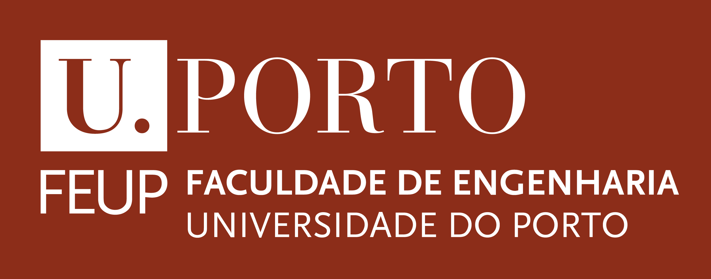

# Modelling & Simulation 24/25 - AMC Credit System - Group WG_12

## Group members

- Marin Bogešić - <up202402707@edu.fe.up.pt>
- Agustina Guercio - <up202402354@edu.fe.up.pt>
- Christopher Schneider - <up202401397@edu.fe.up.pt>

## Setup

1. `git clone https://github.com/mbogesic/MS_Porto`
2. `cd MS_Porto`
3. Open `simulation.py`.   (OPTIONAL)
4. Tweak `compute_reward()` and `update_credits()` functions to your liking to test/add different policies(currently only the baseline model available).      (OPTIONAL)
5. Open `dashboard.py`.      (OPTIONAL)
6. Tweak `num_agents` and `episodes` variables in lines 25/26 to your liking. Default is 1000 agents and 60 episodes (currently only the baseline model available).    (OPTIONAL)

## Running Simulation
1. Run ```dashboard.py``` in your IDE of choice (we use VSCode) or `python dashboard.py` / `python3 dashboard.py` .
2. `pip install` all eventual necessary modules if necessary
3. Validate if the following is visible in your console:
    ```
    Dash is running on http://127.0.0.1:8050/
    
     * Serving Flask app 'dashboard'
     * Debug mode: off
    WARNING: This is a development server. Do not use it in a production deployment. Use a production WSGI server instead.
     * Running on http://127.0.0.1:8050
    Press CTRL+C to quit
    ```
4. In your browser of choice, open the url `http://localhost:8050/` (we use Firefox)
5. Explore the simulated data.


